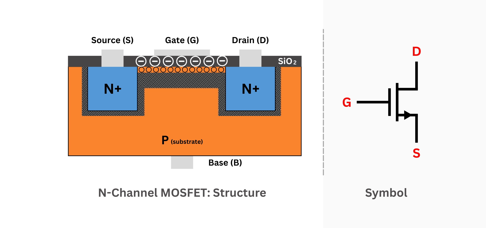

# مبانی ترانزیستور

## ترانزیستور چیست؟

ترانزیستور یک قطعه الکترونیکی است که مانند یک کلید عمل می‌کند.

## انواع ترانزیستور در مدارهای دیجیتال

### NMOS (N-channel MOSFET)
- وقتی گیت HIGH است، رسانا می‌شود
- جریان را از Drain به Source می‌برد
- در Verilog با `nmos` نمایش داده می‌شود

### PMOS (P-channel MOSFET)
- وقتی گیت LOW است، رسانا می‌شود
- جریان را از Source به Drain می‌برد
- در Verilog با `pmos` نمایش داده می‌شود

## CMOS Technology

CMOS مخفف Complementary MOS است که:

- از NMOS و PMOS با هم استفاده می‌کند
- مصرف توان پایین دارد
- در تمام مدارهای دیجیتال مدرن به کار می‌رود

## نحوه عملکرد

### NMOS
```
Gate = 1 → ON  (رسانا)
Gate = 0 → OFF (قطع)
```

### PMOS
```
Gate = 0 → ON  (رسانا)
Gate = 1 → OFF (قطع)
```

## کاربرد در Verilog

در Verilog می‌توانیم با دستورات زیر ترانزیستور بسازیم:
```verilog
nmos n1(drain, source, gate);
pmos p1(drain, source, gate);
```

## مثال ساده: کلید
```verilog
module switch_example(
    input control,
    input signal_in,
    output signal_out
);

nmos sw1(signal_out, signal_in, control);

endmodule
```

وقتی control=1، سیگنال عبور می‌کند.

## چرا این سطح مهم است؟

- درک عمیق‌تر از نحوه کار مدارها
- بهینه‌سازی مصرف توان
- طراحی مدارهای سفارشی

اما در عمل، بیشتر از سطوح بالاتر استفاده می‌شود.

## جمع‌بندی

ترانزیستورها اجزای اولیه تمام مدارهای دیجیتال هستند و NMOS و PMOS دو نوع اصلی آن‌ها می‌باشند.